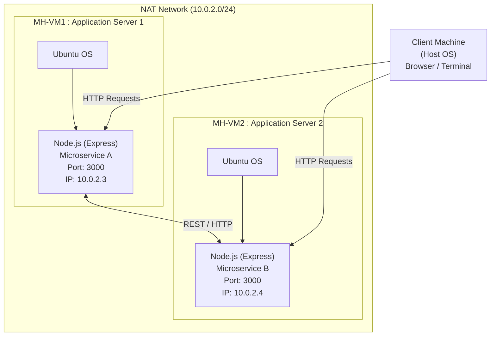

# Assignment-1-VCC

## Assignment Objective:
Create and configure multiple Virtual Machines (VMs) using VirtualBox, establish a network between them, and deploy a microservice-based application across the connected VMs.

## Deliverables:

1. **Document Report:**
    - Step-by-Step Instructions for Implementation:
        - Installation of VirtualBox and creation of multiple VMs.
        - Configuration of network settings to connect the VMs.
        - Deployment of a simple microservice application (e.g., a RESTful API or a Node.js-based service) across the VMs.

2. **Architecture Design:**
    - Diagram showing the connection of VMs and their roles in hosting the microservice application.
    - Detailed steps

## 2. Phase 1: Environment Setup

### 2.1 Download Prerequisites

Ensure you have the following software downloaded:

- **Oracle VirtualBox**: for Windoows https://www.virtualbox.org/wiki/Downloads
- **Ubuntu ISO**: Desktop ISO image (Version 24.04 LTS is recommended) https://ubuntu.com/download/desktop

### 2.2 Create Virtual Machines

Created 2 separate Virtual Machines:

- **MH-VM1**: Application Server 1
- **MH-VM2**: Application Server 2


**Steps for each VM:**

1. Open VirtualBox and click the **New** button.
2. **Name**: Enter a unique name (e.g., "Microservice MH-VM1").
3. **ISO Image**: Select the downloaded Ubuntu ISO file.
4. **Hardware**: Allocate at least 3GB of RAM and 2 CPUs.
5. **Hard Disk**: The default 25GB is sufficient.
6. **Finish**: Click Finish to create the VM.
7. **Install OS**: Start the VM and follow the on-screen prompts to install Ubuntu.
8. **Repeat**: Perform these steps again to create VM2

## 3. Phase 2: Networking & Basic Configuration

## IMPORTANT 
1] Create Nat Network


2] Select same in both vms


### 3.1 Verify Connectivity

1. Open the terminal in mh-vm1 andmh-vm2.


2. Find the IP address of each machine using the following command:

```bash
ip a
```

mh-vm1 IP Address :10.0.2.3
mh-vm2 IP Address :10.0.2.4


### 3.2 Test Connection

 VMs can communicate with each other, I tried ping command from mh-vm2  to mh-vm1:

```bash
ping 10.0.2.3
```

 VMs can communicate with each other, I tried ping command from mh-vm1 to mh-vm2 :

```bash
ping 10.0.2.4
```


### 3.3 Install Dependencies (mh-vm1 & vm-m2)

Update the package manager and install Node.js and npm on both application VMs (mh-vm1 & vm-m2):

```bash
sudo apt update
sudo apt install -y nodejs npm
```

## 4. Phase 3: Microservice Development (mh-vm1)

### 4.1 Initialize Project

Create a new directory for your service:

```bash
mkdir new-service && cd new-service
```

Initialize the Node.js project:

```bash
npm init -y
```

Install the Express framework:

```bash
npm install express
```

### 4.2 Create Application Code

Create a file named `index.js` using a text editor (like nano or vi) and paste the following code:

```javascript
const express = require('express');
const app = express();
const port = 3000;

app.get('/', (req, res) => {
    res.json({ message: 'Hello from Mahantesh I am  mh-vm1' });
});

app.listen(port, '0.0.0.0', () => {
    console.log(`Server running on port ${port}`);
});
```

### 4.3 Test Locally

Start the server:

```bash
node index.js
```


Open a terminal in mh-vm2 and test the connection:

# installed curl in mh-vm2


```bash
curl http://10.0.2.3:3000
```

JSON response received from microservice running in mh-vm1 and request sent in mh-vm2


JSON response received from microservice running in mh-vm2 and request sent in mh-vm1


## Architecture Design Diagram

### System Overview

The microservice-based application is deployed across two Virtual Machines with the following architecture:




#### Architecture Diagram

```
┌─────────────────────────────────────────────────────────────────┐
│                    NAT Network (10.0.2.0/24)                    │
│                                                                 │
│  ┌──────────────────────────────────────────────────────────┐  │
│  │            Host Machine (Client/Testing)                 │  │
│  │            Terminal/Browser                              │  │
│  └────────────────────┬─────────────────────────────────────┘  │
│                       │                                         │
│      ┌────────────────┴────────────────┐                        │
│      │                                 │                        │
│  ┌───▼──────────────────┐  ┌──────────▼──────────────────┐    │
│  │     MH-VM1           │  │        MH-VM2              │    │
│  │  (App Server 1)      │  │    (App Server 2)          │    │
│  │                      │  │                            │    │
│  │ Node.js Express      │  │  Node.js Express           │    │
│  │ Microservice         │  │  Microservice              │    │
│  │ Port: 3000           │  │  Port: 3000                │    │
│  │ IP: 10.0.2.3         │  │  IP: 10.0.2.4              │    │
│  │                      │  │                            │    │
│  │ Running Directly     │  │  Running Directly          │    │
│  │ on Ubuntu            │  │  on Ubuntu                 │    │
│  └──────────────────────┘  └────────────────────────────┘    │
│           ▲                                 ▲                  │
│           │                                 │                  │
│           └────────────────┬────────────────┘                  │
│                            │                                   │
│                   Direct Communication                         │
│                                                                │
└─────────────────────────────────────────────────────────────────┘
```

### Architecture Components

#### 1. **Application Servers (MH-VM1 & MH-VM2)**
   - **Role**: Run the microservice application
   - **Software Stack**: 
     - Node.js (JavaScript runtime)
     - Express (Web framework)
   - **Microservice Details**:
     - REST API endpoint: `/` (returns JSON message)
     - Port: 3000
   - **IP Addresses**:
     - MH-VM1: 10.0.2.3
     - MH-VM2: 10.0.2.4
   - **Deployment Method**: Running directly on Ubuntu OS

#### 2. **Network Configuration**
   - **Network Type**: NAT Network (Virtual Network)
   - **Network Range**: 10.0.2.0/24
   - **Communication**: VMs communicate via the NAT network
   - **Features**: 
     - VMs can reach each other directly (verified via ping)
     - Isolated from host machine network
     - Centralized gateway for external connectivity

### Data Flow

1. **Client Request**: User sends HTTP request to application server (10.0.2.3:3000 or 10.0.2.4:3000)
2. **Application Processing**: Express server processes request and returns JSON response
3. **Response Return**: Response is sent back to client

### Key Features

- **Microservice Architecture**: Independent application instances running on separate VMs
- **Network Isolation**: NAT Network ensures secure VM-to-VM communication
- **Direct Deployment**: Simple Node.js Express servers running directly on Ubuntu
- **Inter-VM Communication**: VMs can communicate directly for testing and debugging
- **Scalability**: New application servers can be added to the NAT network

### Testing Approach

1. **Direct Server Testing**: Connect directly to MH-VM1 (10.0.2.3:3000) or MH-VM2 (10.0.2.4:3000)
2. **Inter-VM Communication**: Test communication between VMs using curl commands
3. **Verification**: Use ping and curl commands to test connectivity and application responses
-----------------------------------------
-----------------------------------
## Extension of Assignment 1 VCC mh-vm3

--------------------------------------


## 5. Phase 4: Containerization with Docker

### 5.1 Install Docker (mh-vm1 & mh-vm2)

Run the following commands on both VM1 and VM2 to install and enable Docker:

```bash
sudo apt install -y docker.io
sudo systemctl enable --now docker
```

### 5.2 Create Dockerfile (mh-vm1)

Inside the `new-service` directory on VM1, create a file named `Dockerfile` with the following content:

```dockerfile
FROM node:18
WORKDIR /usr/src/app
COPY package*.json ./
RUN npm install
COPY . .
EXPOSE 3000
CMD ["node", "index.js"]
```

### 5.3 Build & Run Image (mh-vm1)

Build the Docker image:

```bash
sudo docker build -t new-service
```

Run the container in detached mode:

```bash
sudo docker run -d -p 3000:3000 new-service
```

Verify it is running:

```bash
sudo docker ps
```

## 6. Phase 5: Deployment via Docker Hub

### 6.1 Push Image (mh-vm1)

logged in docker

```bash
sudo docker login
```

Tag your image:

```bash
sudo docker tag new-service hackermonty/new-service:latest
```

Push the image to the registry:

```bash
sudo docker push hackermonty/new-service:latest
```

### 6.2 Pull & Run (mh-vm2)

Switch to mh-vm2 and deploy the image:

Pull the image from Docker Hub:

```bash
sudo docker pull hackermonty/new-service:latest
```

Run the container:

```bash
sudo docker run -d -p 3000:3000 hackermonty/new-service:latest
```

## 7. Phase 6: Load Balancer Setup (mh-vm3)

### 7.1 Install Nginx

On the third VM (mh-vm3), install Nginx:

```bash
sudo apt update
sudo apt install -y nginx
```

### 7.2 Configure Load Balancing

Edit the Nginx configuration file (typically `/etc/nginx/nginx.conf` or `/etc/nginx/sites-available/default`). Add or modify the `http` block to include the upstream configuration:

```nginx
http {
    upstream backend_cluster {
       
        server 10.0.2.3:3000; 
        server 10.0.2.4:3000;
    }

    server {
        listen 80;
        
        location / {
            proxy_pass http://backend_cluster;
        }
    }
}
```

### 7.3 Restart Nginx

Validate the configuration and restart the service:

```bash
sudo nginx -t
sudo systemctl restart nginx
```

## 8. Final step

To verify that the load balancer is working and distributing traffic between mh-vm1 and mh-vm3:

1. Find the IP address of VM3 (Load Balancer).
2. Run the following loop command from your host machine or another terminal:

```bash
while true; do curl http://10.0.2.5; echo; sleep 1; done
```

**Result**: Nginx will distribute these requests between mh-vm1 and mh-vm2 (often using a Round Robin algorithm by default).
