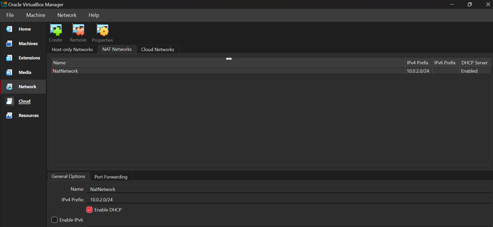
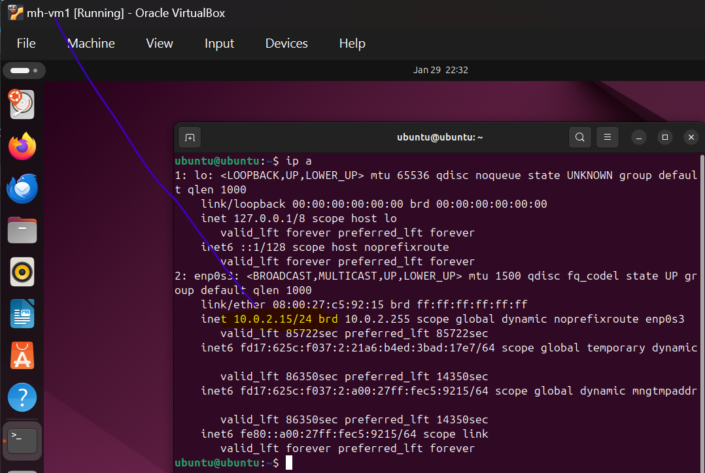
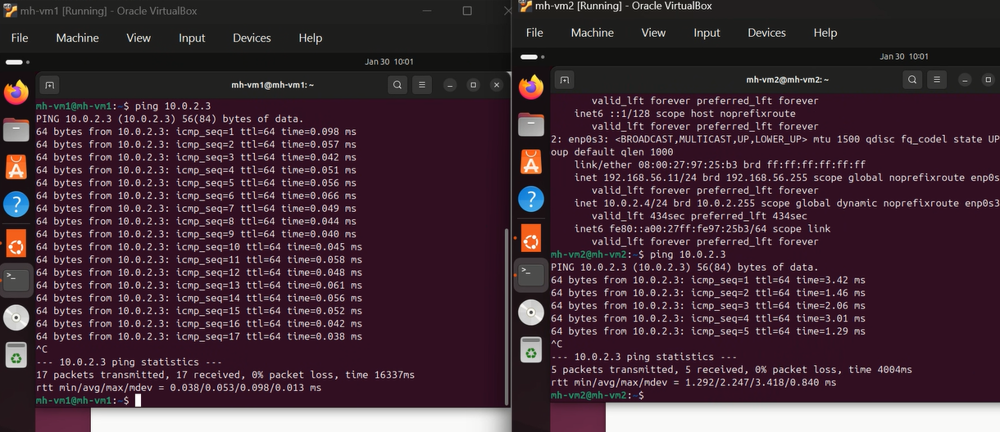
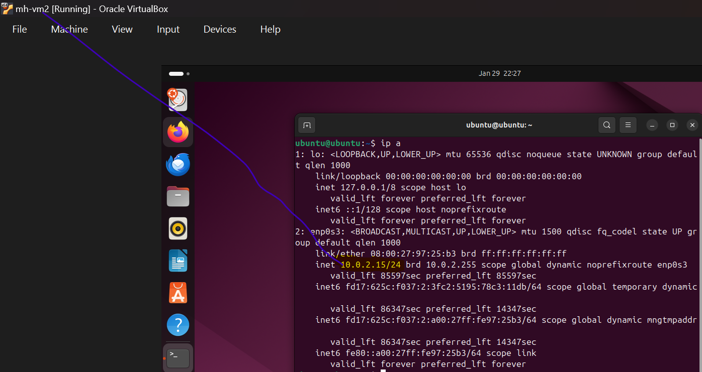
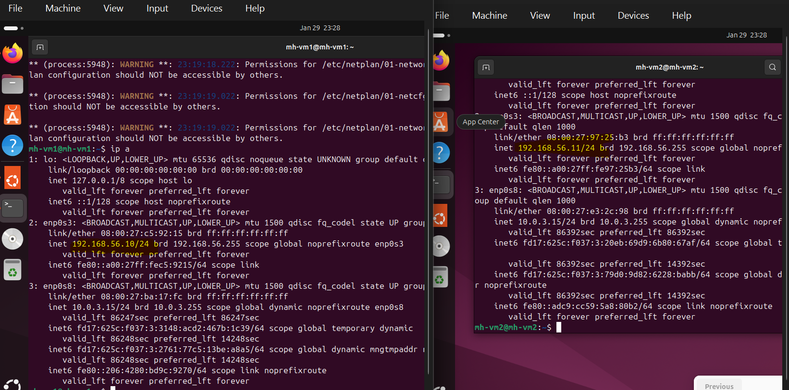
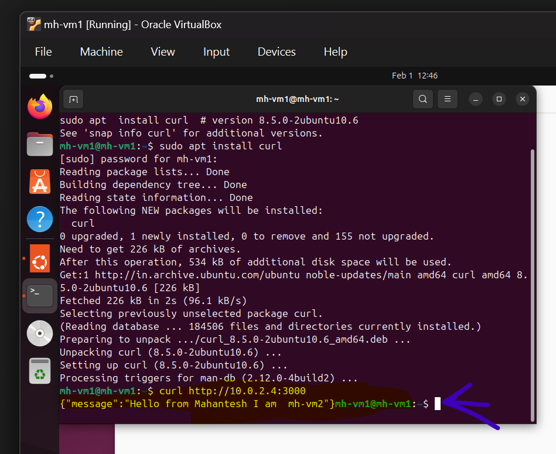
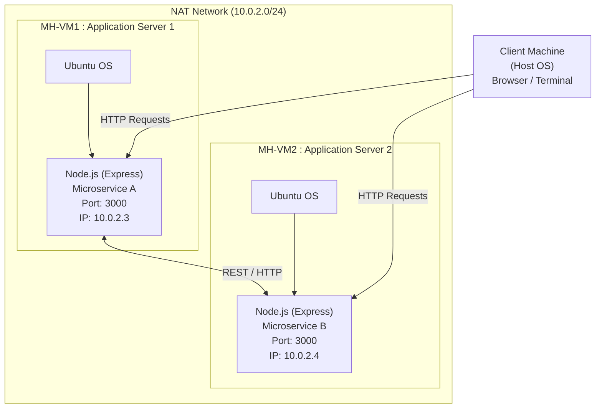
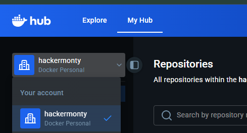
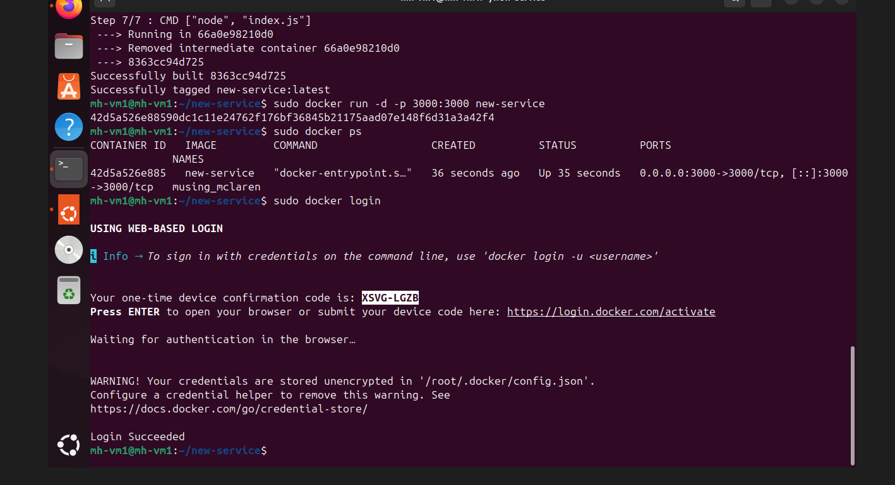

# Assignment-1-VCC

## Assignment Objective:
Create and configure multiple Virtual Machines (VMs) using VirtualBox, establish a network between them, and deploy a microservice-based application across the connected VMs.

## Deliverables:

1. **Document Report:**
    - Step-by-Step Instructions for Implementation:
        - Installation of VirtualBox and creation of multiple VMs.
        - Configuration of network settings to connect the VMs.
        - Deployment of a simple microservice application (e.g., a RESTful API or a Node.js-based service) across the VMs.

2. **Architecture Design:**
    - Diagram showing the connection of VMs and their roles in hosting the microservice application.
    - Detailed steps

## 2. Phase 1: Environment Setup

### 2.1 Download Prerequisites

Ensure you have the following software downloaded:

- **Oracle VirtualBox**: for Windoows https://www.virtualbox.org/wiki/Downloads
- **Ubuntu ISO**: Desktop ISO image (Version 24.04 LTS is recommended) https://ubuntu.com/download/desktop

### 2.2 Create Virtual Machines

Created 2 separate Virtual Machines:

- **MH-VM1**: Application Server 1
- **MH-VM2**: Application Server 2


**Steps for each VM:**

1. Open VirtualBox and click the **New** button.
2. **Name**: Enter a unique name (e.g., "Microservice MH-VM1").
3. **ISO Image**: Select the downloaded Ubuntu ISO file.
4. **Hardware**: Allocate at least 3GB of RAM and 2 CPUs.
5. **Hard Disk**: The default 25GB is sufficient.
6. **Finish**: Click Finish to create the VM.
7. **Install OS**: Start the VM and follow the on-screen prompts to install Ubuntu.
8. **Repeat**: Perform these steps again to create VM2

## 3. Phase 2: Networking & Basic Configuration

## IMPORTANT 
1] Create Nat Network


2] Select same in both vms


### 3.1 Verify Connectivity

1. Open the terminal in mh-vm1 andmh-vm2.


2. Find the IP address of each machine using the following command:

```bash
ip a
```

mh-vm1 IP Address :10.0.2.3
mh-vm2 IP Address :10.0.2.4




### 3.2 Test Connection

 VMs can communicate with each other, I tried ping command from mh-vm2  to mh-vm1:

```bash
ping 10.0.2.3
```

 VMs can communicate with each other, I tried ping command from mh-vm1 to mh-vm2 :

```bash
ping 10.0.2.4
```



### 3.3 Install Dependencies (mh-vm1 & vm-m2)

Update the package manager and install Node.js and npm on both application VMs (mh-vm1 & vm-m2):

```bash
sudo apt update
sudo apt install -y nodejs npm
```

## 4. Phase 3: Microservice Development (mh-vm1)

### 4.1 Initialize Project

Create a new directory for your service:

```bash
mkdir new-service && cd new-service
```

Initialize the Node.js project:

```bash
npm init -y
```

Install the Express framework:

```bash
npm install express
```

### 4.2 Create Application Code

Create a file named `index.js` using a text editor (like nano or vi) and paste the following code:

```javascript
const express = require('express');
const app = express();
const port = 3000;

app.get('/', (req, res) => {
    res.json({ message: 'Hello from Mahantesh I am  mh-vm1' });
});

app.listen(port, '0.0.0.0', () => {
    console.log(`Server running on port ${port}`);
});
```

### 4.3 Test Locally

Start the server:

```bash
node index.js
```





Open a terminal in mh-vm2 and test the connection:

# installed curl in mh-vm2


```bash
curl http://10.0.2.3:3000
```

JSON response received from microservice running in mh-vm1 and request sent in mh-vm2




JSON response received from microservice running in mh-vm2 and request sent in mh-vm1


## Architecture Design Diagram

### System Overview

The microservice-based application is deployed across two Virtual Machines with the following architecture:




#### Architecture Diagram

```
┌─────────────────────────────────────────────────────────────────┐
│                    NAT Network (10.0.2.0/24)                    │
│                                                                 │
│  ┌──────────────────────────────────────────────────────────┐  │
│  │            Host Machine (Client/Testing)                 │  │
│  │            Terminal/Browser                              │  │
│  └────────────────────┬─────────────────────────────────────┘  │
│                       │                                         │
│      ┌────────────────┴────────────────┐                        │
│      │                                 │                        │
│  ┌───▼──────────────────┐  ┌──────────▼──────────────────┐    │
│  │     MH-VM1           │  │        MH-VM2              │    │
│  │  (App Server 1)      │  │    (App Server 2)          │    │
│  │                      │  │                            │    │
│  │ Node.js Express      │  │  Node.js Express           │    │
│  │ Microservice         │  │  Microservice              │    │
│  │ Port: 3000           │  │  Port: 3000                │    │
│  │ IP: 10.0.2.3         │  │  IP: 10.0.2.4              │    │
│  │                      │  │                            │    │
│  │ Running Directly     │  │  Running Directly          │    │
│  │ on Ubuntu            │  │  on Ubuntu                 │    │
│  └──────────────────────┘  └────────────────────────────┘    │
│           ▲                                 ▲                  │
│           │                                 │                  │
│           └────────────────┬────────────────┘                  │
│                            │                                   │
│                   Direct Communication                         │
│                                                                │
└─────────────────────────────────────────────────────────────────┘
```

### Architecture Components

#### 1. **Application Servers (MH-VM1 & MH-VM2)**
   - **Role**: Run the microservice application
   - **Software Stack**: 
     - Node.js (JavaScript runtime)
     - Express (Web framework)
   - **Microservice Details**:
     - REST API endpoint: `/` (returns JSON message)
     - Port: 3000
   - **IP Addresses**:
     - MH-VM1: 10.0.2.3
     - MH-VM2: 10.0.2.4
   - **Deployment Method**: Running directly on Ubuntu OS

#### 2. **Network Configuration**
   - **Network Type**: NAT Network (Virtual Network)
   - **Network Range**: 10.0.2.0/24
   - **Communication**: VMs communicate via the NAT network
   - **Features**: 
     - VMs can reach each other directly (verified via ping)
     - Isolated from host machine network
     - Centralized gateway for external connectivity

### Data Flow

1. **Client Request**: User sends HTTP request to application server (10.0.2.3:3000 or 10.0.2.4:3000)
2. **Application Processing**: Express server processes request and returns JSON response
3. **Response Return**: Response is sent back to client

### Key Features

- **Microservice Architecture**: Independent application instances running on separate VMs
- **Network Isolation**: NAT Network ensures secure VM-to-VM communication
- **Direct Deployment**: Simple Node.js Express servers running directly on Ubuntu
- **Inter-VM Communication**: VMs can communicate directly for testing and debugging
- **Scalability**: New application servers can be added to the NAT network

### Testing Approach

1. **Direct Server Testing**: Connect directly to MH-VM1 (10.0.2.3:3000) or MH-VM2 (10.0.2.4:3000)
2. **Inter-VM Communication**: Test communication between VMs using curl commands
3. **Verification**: Use ping and curl commands to test connectivity and application responses
-----------------------------------------
-----------------------------------
## Extension of Assignment 1 VCC mh-vm3

--------------------------------------


## 5. Phase 4: Containerization with Docker

### 5.1 Install Docker (mh-vm1 & mh-vm2)

Run the following commands on both VM1 and VM2 to install and enable Docker:

```bash
sudo apt install -y docker.io
sudo systemctl enable --now docker
```

### 5.2 Create Dockerfile (mh-vm1)

Inside the `new-service` directory on VM1, create a file named `Dockerfile` with the following content:

#### Step 1: Navigate to the project directory

```bash
cd ~/new-service
```

#### Step 2: Create the Dockerfile

Use nano or your preferred text editor:

```bash
nano Dockerfile
```

#### Step 3: Add Dockerfile content

```dockerfile
FROM node:18
WORKDIR /usr/src/app
COPY package*.json ./
RUN npm install
COPY . .
EXPOSE 3000
CMD ["node", "index.js"]
```

**Explanation of Dockerfile Instructions:**

- **`FROM node:18`**: Uses the official Node.js version 18 image as the base. This provides a pre-configured Linux environment with Node.js and npm installed.

- **`WORKDIR /usr/src/app`**: Sets the working directory inside the container to `/usr/src/app`. All subsequent commands will execute from this directory.

- **`COPY package*.json ./`**: Copies `package.json` and `package-lock.json` (if exists) from your local machine to the container. This is done separately to leverage Docker's layer caching—if dependencies haven't changed, Docker can reuse this layer.

- **`RUN npm install`**: Installs all the Node.js dependencies specified in `package.json`. This step runs during the image build process.

- **`COPY . .`**: Copies all remaining files from the current directory on your host machine into the container's working directory. This includes `index.js` and any other application files.

- **`EXPOSE 3000`**: Documents that the container will listen on port 3000 at runtime. This doesn't actually publish the port; it's informational for users of the image.

- **`CMD ["node", "index.js"]`**: Specifies the command to run when the container starts. This starts your Node.js application using the `index.js` file.

#### Step 4: Save and exit

- If using nano: Press `Ctrl+X`, then `Y`, then `Enter`
- If using vi/vim: Press `Esc`, type `:wq`, then `Enter`

#### Step 5: Verify the Dockerfile

Check that the file was created successfully:

```bash
cat Dockerfile
```

You should see all the Dockerfile instructions displayed in the terminal.

### 5.3 Build & Run Image (mh-vm1)

Build the Docker image:

```bash
sudo docker build -t new-service .
```

**Note**: The `.` at the end specifies the build context (current directory). Docker will look for the Dockerfile in the current directory and use files from this location during the build.

Run the container in detached mode:

```bash
sudo docker run -d -p 3000:3000 new-service
```

Verify it is running:

```bash
sudo docker ps
```


## 6. Phase 5: Deployment via Docker Hub

### 6.1 Push Image (mh-vm1)

logged in docker

```bash
sudo docker login
```

Tag your image:

```bash
sudo docker tag new-service hackermonty/new-service:latest
```

Push the image to the registry:

```bash
sudo docker push hackermonty/new-service:latest
```



### 6.2 Pull & Run (mh-vm2)

Switch to mh-vm2 and deploy the image:

Pull the image from Docker Hub:

```bash
sudo docker pull hackermonty/new-service:latest
```

Run the container:

```bash
sudo docker run -d -p 3000:3000 hackermonty/new-service:latest
```

## 7. Phase 6: Load Balancer Setup (mh-vm3)

### 7.1 Create and Configure Third VM (mh-vm3)

#### Step 1: Create MH-VM3

Follow the same VM creation process from Phase 1 (Section 2.2) to create a third VM:

1. Open VirtualBox and click **New**
2. **Name**: "Microservice MH-VM3" (Load Balancer)
3. **ISO Image**: Select Ubuntu ISO
4. **Hardware**: Allocate 3GB RAM and 2 CPUs
5. **Hard Disk**: 25GB is sufficient
6. Install Ubuntu following on-screen prompts

#### Step 2: Configure Network

Ensure mh-vm3 is connected to the same NAT Network as mh-vm1 and mh-vm2:

1. In VirtualBox, select MH-VM3
2. Click **Settings** → **Network**
3. Set **Attached to**: NAT Network
4. Select the same NAT Network used for VM1 and VM2

#### Step 3: Verify IP Address

Boot mh-vm3 and check its IP address:

```bash
ip a
```

**Expected**: mh-vm3 should get an IP like `10.0.2.5` (or similar in the 10.0.2.x range)

#### Step 4: Test Connectivity

Verify mh-vm3 can reach both application servers:

```bash
# Test connection to mh-vm1
ping -c 4 10.0.2.3

# Test connection to mh-vm2
ping -c 4 10.0.2.4

# Test HTTP connectivity to services
curl http://10.0.2.3:3000
curl http://10.0.2.4:3000
```

### 7.2 Install Nginx

On mh-vm3, install Nginx web server which will act as the load balancer:

```bash
sudo apt update
sudo apt install -y nginx
```

#### Verify Installation

Check that Nginx is installed and running:

```bash
# Check Nginx version
nginx -v

# Check Nginx service status
sudo systemctl status nginx
```

You should see that Nginx is active and running.

#### Test Default Nginx Page

From another VM or terminal, access the default Nginx page:

```bash
curl http://10.0.2.5
```

You should see the default "Welcome to nginx!" HTML page.

### 7.3 Configure Load Balancing

Now configure Nginx to distribute traffic between mh-vm1 and mh-vm2.

#### Step 1: Backup Original Configuration

Always backup before making changes:

```bash
sudo cp /etc/nginx/sites-available/default /etc/nginx/sites-available/default.backup
```

#### Step 2: Edit Configuration File

Open the Nginx default site configuration:

```bash
sudo nano /etc/nginx/sites-available/default
```

#### Step 3: Replace Configuration

Delete the existing content and replace it with the following load balancer configuration:

```nginx
upstream backend_cluster {
    # Define backend servers
    server 10.0.2.3:3000;  # mh-vm1
    server 10.0.2.4:3000;  # mh-vm2
}

server {
    listen 80;
    listen [::]:80;
    
    server_name _;
    
    location / {
        # Pass requests to the backend cluster
        proxy_pass http://backend_cluster;
        
        # Pass original client information
        proxy_set_header Host $host;
        proxy_set_header X-Real-IP $remote_addr;
        proxy_set_header X-Forwarded-For $proxy_add_x_forwarded_for;
        proxy_set_header X-Forwarded-Proto $scheme;
        
        # Timeout settings
        proxy_connect_timeout 60s;
        proxy_send_timeout 60s;
        proxy_read_timeout 60s;
    }
}
```

**Configuration Explanation:**

- **`upstream backend_cluster`**: Defines a group of backend servers. Nginx will distribute requests among these servers using round-robin algorithm by default.

- **`server 10.0.2.3:3000`** and **`server 10.0.2.4:3000`**: The two application servers that will receive load-balanced traffic.

- **`listen 80`**: Nginx listens on port 80 (standard HTTP port) for incoming requests.

- **`proxy_pass http://backend_cluster`**: Forwards incoming requests to one of the backend servers in the cluster.

- **`proxy_set_header`** directives: Pass original client information to backend servers, which is important for logging and application logic.

- **Timeout settings**: Prevent connections from hanging indefinitely.

#### Step 4: Save and Exit

- If using nano: Press `Ctrl+X`, then `Y`, then `Enter`
- If using vi/vim: Press `Esc`, type `:wq`, then `Enter`

### 7.4 Test and Restart Nginx

#### Step 1: Validate Configuration

Before restarting, check for syntax errors:

```bash
sudo nginx -t
```

**Expected output:**
```
nginx: the configuration file /etc/nginx/nginx.conf syntax is ok
nginx: configuration file /etc/nginx/nginx.conf test is successful
```

If you see any errors, go back and fix the configuration file.

#### Step 2: Restart Nginx

Apply the new configuration:

```bash
sudo systemctl restart nginx
```

#### Step 3: Verify Nginx is Running

```bash
sudo systemctl status nginx
```

Ensure the status shows "active (running)".

### 7.5 Verify Load Balancing

#### Test 1: Single Request

From any VM or terminal, send a request to the load balancer:

```bash
curl http://10.0.2.5
```

You should see a JSON response from either mh-vm1 or mh-vm2.

#### Test 2: Multiple Requests

Send multiple requests to observe round-robin distribution:

```bash
curl http://10.0.2.5
curl http://10.0.2.5
curl http://10.0.2.5
curl http://10.0.2.5
```

You should see responses alternating between:
- `{"message":"Hello from Mahantesh I am mh-vm1"}`
- `{"message":"Hello from Mahantesh I am mh-vm2"}` (if mh-vm2 has different message)

#### Test 3: Check Nginx Logs

View access logs to see which backend server handled each request:

```bash
sudo tail -f /var/log/nginx/access.log
```

### 7.6 Troubleshooting

#### Issue: "502 Bad Gateway" Error

**Cause**: Backend servers are not reachable or not running.

**Solution:**
1. Verify both mh-vm1 and mh-vm2 Docker containers are running:
   ```bash
   sudo docker ps
   ```
2. Test direct connectivity from mh-vm3:
   ```bash
   curl http://10.0.2.3:3000
   curl http://10.0.2.4:3000
   ```
3. Check firewall settings on backend VMs

#### Issue: "Connection Refused"

**Cause**: Nginx is not running or wrong port.

**Solution:**
```bash
sudo systemctl restart nginx
sudo systemctl status nginx
```

#### Issue: Always Getting Same Server Response

**Cause**: One backend server might be down.

**Solution:**
- Check which server is responding
- Verify both Docker containers are running on mh-vm1 and mh-vm2
- Check Nginx error logs:
  ```bash
  sudo tail -f /var/log/nginx/error.log
  ```

## 8. Final step

To verify that the load balancer is working and distributing traffic between mh-vm1 and mh-vm3:

1. Find the IP address of VM3 (Load Balancer).
2. Run the following loop command from your host machine or another terminal:

```bash
while true; do curl http://10.0.2.5; echo; sleep 1; done
```

**Result**: Nginx will distribute these requests between mh-vm1 and mh-vm2 (often using a Round Robin algorithm by default).
